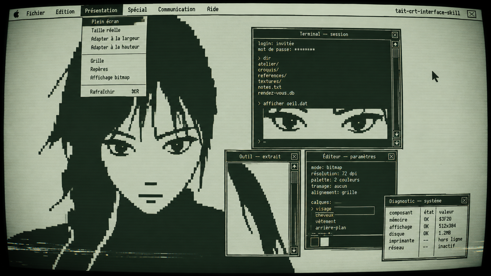
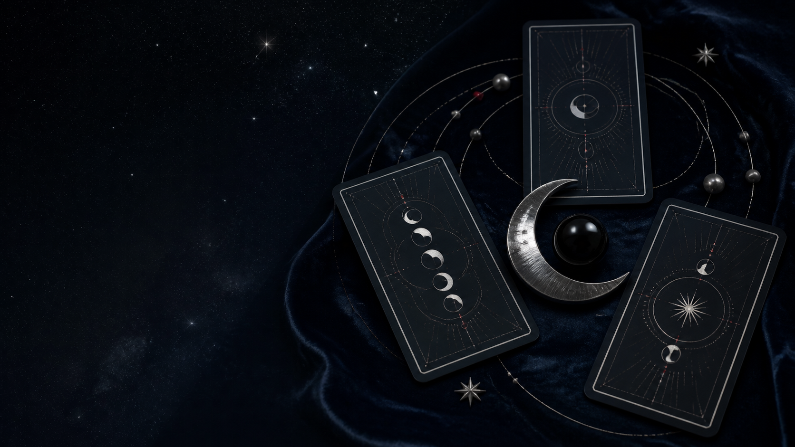
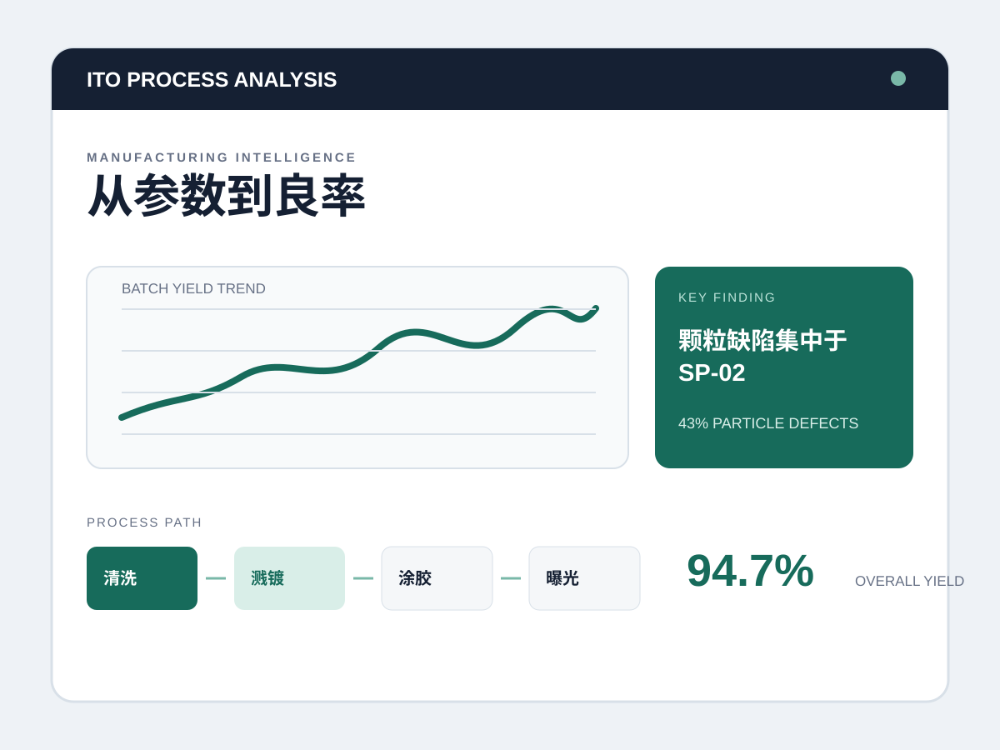

# 古月的作品集

一个以米白色编辑风格呈现的个人作品集网站，集中展示平面设计、UI / 产品、绘画、动画，以及 Vibecoding 网页作品。

在线访问：[www.guyuehub.asia](https://www.guyuehub.asia/)



## 项目内容

- 个人介绍、经历与联系方式
- 按类别浏览作品：Vibecoding 网站、平面设计、UI / 产品、绘画、动画 / 视频等
- 三个可直接进入的网页作品：月引原创塔罗体验、ITO Process Analysis、赛炳坤工作室品牌独立站
- 响应式布局，适配桌面与手机浏览
- 作品卡片动效、筛选和图片预览

## Vibecoding 网站作品

| 月引 · 原创塔罗体验 | ITO Process Analysis | 赛炳坤工作室品牌独立站 |
| --- | --- | --- |
|  |  |  |

## 本地预览

这是一个无需安装依赖的静态网站。下载或克隆项目后，直接打开 `index.html` 即可预览；也可以使用任意本地静态服务器打开。

## 项目结构

```text
index.html             网站主页
css/style.css          页面样式与响应式规则
js/                    筛选、动效与交互逻辑
images/                作品封面和页面图片
tarot/                 月引塔罗互动网站
ito-process-analysis/  制程分析交互页面
saibingkun-store/      品牌独立站
```

## 部署

项目通过 GitHub Pages 发布，并绑定自定义域名 `www.guyuehub.asia`。推送到 `main` 分支后，GitHub Actions 会自动更新线上网站。
